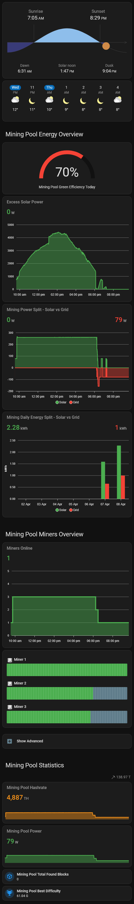
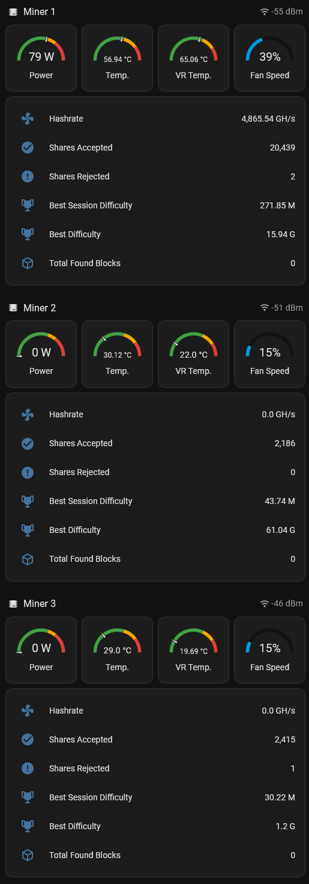

# Project Solar Mining

## 1] Overview
Project Solar Mining introduces a smart, self-regulating mining pool that enables households to mine Bitcoin using excess solar power.

<table>
  <tr>
    <td valign="top">
      
    </td>
    <td valign="top">
      
    </td>
  </tr>
</table>

This self-regulating mining pool dynamically manages a Bitcoin mining pool (up to 3 miners) to optimize energy usage based on excess solar power being returned to the grid. 
It ensures miners only run when there's sufficient excess power, preventing unnecessary grid draw, while incorporating hysteresis to avoid frequent on/off cycles that could stress hardware. 

### 1.1] How It Works

#### 1.1.1] Trigger
The automation runs every 15 minutes. 
This interval allows for regular checks without overwhelming the system.

#### 1.1.2] Setup Excess Power Variable
It sets a variable [Excess Solar Power Remaining] to the current excess solar power. 
This represents the current excess solar power budget available for miners. 
As miners are activated, this value is reduced to reflect remaining capacity.

#### 1.1.3] Regulating Each Miner
The automation handles each miner sequentially (Miner 1, then 2, then 3) using identical logic.

**Activation Check (with Hysteresis)**
- Skips if the miner is out of circuit
- Activates if:
	- Requirements are overridden, OR
	- [Excess Solar Power Remaining] meets or exceeds the miner's power need, AND:
		- The miner is already on, OR
		- The miner's specific excess solar power need condition has been true for at least 15 minutes

- If conditions are met and the miner is off:
	- Restarts the miner
	- Sets the miner's state to "on"
	- If requirements are not overridden, subtracts the miner's power need from the remaining excess solar power variable (to allocate it for this miner)

**Shutdown Check (with Hysteresis)**
- If activation conditions aren't met, checks for shutdown:
	- Miner is out of circuit, OR
	- Shutdown threshold has been true for at least 7 minutes (e.g., low excess solar power)

- If shutdown is triggered and the miner is running:
	- Shuts down miner
	- Sets the state to "off"

### 1.2] Expected Behavior
**When Excess Solar is High**

Miners start in order (1 → 2 → 3) if conditions hold for 15 minutes. They run until excess drops.

**When Excess Solar Drops**

Miners shut down in reverse order (implicitly, as checks are sequential) after 7 minutes of insufficient power.

**Manual Control**

"Out Of Circuit" disables a miner entirely.
Use "Requirements Override" to force a miner on, regardless of power. 

## 2] Prerequisites
*Knowledge of each of these prerequisites is required and is not covered in this project.*

- Home Assistant (> v2026.2.1) with Zigbee setup
- Home Assistant integration "Meteorologisk institutt (Met.no)"
- HACS integration "Mushroom"
- Grid return sensor in Watt setup in Home Assistant (Used to evaluate excess solar power)
- Zigbee smart plug (e.g., Innr SP 240) setup in Home Assistant
- Powerstrip
- 3 NerdQAxe++ (> v1.0.36) miners (This project limits to 3 miners, but expansion is straightforward)

## 3] Mining pool hardware setup
- Plug the NerdQAxe++ miners all in the same powerstrip
- Plug the zigbee smart plug in the wall socket
- Plug the powerstrip in the Innr Zigbee smart plug

## 4] Home Assistant Project Solar Mining setup
### 4.1] Extract
- Extract ProjectSolarMining_vx.x.x.zip 

The directory structure will look like this:
```
ProjectSolarMining_vx.x.x/
├── automations/
│   ├── mining_pool_emergency_shutdown.yaml
│   ├── mining_pool_regulate.yaml
│   ├── mining_pool_regulate_start.yaml
│   └── mining_pool_regulate_stop.yaml
├── dashboards/
│   └── dashboard-mining-pool.yaml
├── packages/
│   └── project-solar-mining/
│       ├── psm_miner_1.yaml
│       ├── psm_miner_2.yaml
│       ├── psm_miner_3.yaml
│       └── psm_mining_pool.yaml
├── license.txt
└── readme.txt
```

### 4.2] Configuration
#### 4.2.1] Package
- Create the directory structure /packages/project_solar_mining/ under /homeassistant/
- Copy the extracted files from /packages/project_solar_mining/ into /homeassistant/packages/project_solar_mining/
- In /homeassistant/configuration.yaml create the following section:
```yaml
homeassistant:
  packages: !include_dir_named packages
```

There should now be 3 psm_miner_x.yaml files in /homeassistant/packages/project_solar_mining/
That's one psm_miner_x.yaml file per NerdQAxe++ miner.

The first sensor in the psm_miner_1.yaml file looks like this:
```yaml
  - sensor:
      - name: "Miner 1"
        icon: "mdi:chip"
        state: "{{ states('input_boolean.miner_1_state') }}"
        attributes:
          api_endpoint_info: "http://192.168.0.10/api/system/info"
          api_endpoint_restart: "http://192.168.0.10/api/system/restart"
          api_endpoint_shutdown: "http://192.168.0.10/api/system/shutdown"
          power_need: 80
```
- In psm_miner_1.yaml:
	- Adjust the IP address in the api_endpoint_x attributes to your first miner's IP address
	- Set power_need to the maximum power the first miner can use
- In psm_miner_2.yaml:
	- Adjust the IP address in the api_endpoint_x attributes to your second miner's IP address
	- Set power_need to the maximum power the second miner can use
- In psm_miner_3.yaml:
	- Adjust the IP address in the api_endpoint_x attributes to your third miner's IP address
	- Set power_need to the maximum power the third miner can use

- In /homeassistant/packages/project_solar_mining/psm_mining_pool.yaml look for the following sensor
```yaml
  - sensor:
      - name: "Excess Solar Power"
        icon: mdi:solar-power-variant-outline
        state: "{{ states('sensor.dsmr_reading_electricity_currently_returned_watt') | int(0) }}"
        unit_of_measurement: "W"
        device_class: power
        state_class: measurement
```
- Change sensor.dsmr_reading_electricity_currently_returned_watt to your own's grid return sensor

#### 4.2.2] Automations
**MINING_POOL_EMERGENCY_SHUTDOWN**
- Create a new automation
- Edit the automation in YAML
- Copy the content of mining_pool_emergency_shutdown.yaml over the placeholder yaml
- Replace "switch.innr_plug_mining_pool" by your own zigbee smart plug switch
- Save the automation with the name MINING_POOL_EMERGENCY_SHUTDOWN

**MINING_POOL_REGULATE**
- Create a new automation
- Edit the automation in YAML
- Copy the content of mining_pool_regulate.yaml over the placeholder yaml
- Save the automation with the name MINING_POOL_REGULATE

**MINING_POOL_REGULATE_START**
- Create a new automation
- Edit the automation in YAML
- Copy the content of mining_pool_regulate_start.yaml over the placeholder yaml
- Replace "switch.innr_plug_mining_pool" by your own zigbee smart plug switch
- Save the automation with the name MINING_POOL_REGULATE_START

**MINING_POOL_REGULATE_STOP**
- Create a new automation
- Edit the automation in YAML
- Copy the content of mining_pool_regulate_stop.yaml over the placeholder yaml
- Replace "switch.innr_plug_mining_pool" by your own zigbee smart plug switch
- Save the automation with the name MINING_POOL_REGULATE_STOP

#### 4.2.3] Dashboard
- Create a new dashboard title Mining Pool, icon mdi:chip and url dashboard-mining-pool
- Edit the dashboard in Raw configuration editor
- Copy the content of dashboard-mining-pool.yaml over the placeholder yaml
- Replace "switch.innr_plug_mining_pool" by your own zigbee smart plug switch
- Save the dashboard

## 5] FAQ
### 5.1] How to add a miner to the mining pool
#### 5.1.1] Package
To add e.g. a fourth miner:
- Copy /homeassistant/packages/project_solar_mining/psm_miner_3.yaml to /homeassistant/packages/project_solar_mining/psm_miner_4.yaml
- Replace all "Miner 3" instances by "Miner 4"
- Replace all "miner_3" instances by "miner_4"
- Adjust the IP address in the api_endpoint_x attributes to your fourth miner's IP address
- Set power_need to the maximum power the fourth miner can use

- In /homeassistant/packages/project_solar_mining/psm_mining_pool.yaml expand the following sensors to include the fourth miner:
	- "Mining Pool Online Miners"
	- "Mining Pool Power"
	- "Mining Pool Hashrate"
	- "Mining Pool Total Found Blocks"
	- "Mining Pool Best Diff Raw"

#### 5.1.2] Automations
**MINING_POOL_EMERGENCY_SHUTDOWN**
- Add a condition to include "When Miner 4 VR Temperature is above 80"

**MINING_POOL_REGULATE**
- Copy block "Regulate Miner 3 with hysteresis" under this block
- Edit the new block in yaml:
	- Replace all "Miner 3" instances by "Miner 4"
	- Replace all "miner_3" instances by "miner_4"

**MINING_POOL_REGULATE_STOP**
- To "Input Boolean 'Turn off' [Miner 1 State] [Miner 2 State] [Miner 3 State]", add Miner 4 State

#### 5.1.3] Dashboard
- Edit the dashboard in Raw configuration editor
- Copy Miner 3 yaml blocks under themselves and edit thme:
	- Replace all "Miner 3" instances by "Miner 4"
	- Replace all "miner_3" instances by "miner_4"

### 5.2] How to remove a miner from circuit (e.g. for a reparation)
- Go to the Mining Pool Dashboard
- Click on "Show Advanced"
- For the miner you want to remove from the circuit:
	- Hold the button "Out Of Circuit"
	- Click the swith to turn it on

### 5.3] How to allow a miner to mine without excess solar power
- Go to the Mining Pool Dashboard
- Click on "Show Advanced"
- For the miner you want to allow mining without excess solar power:
	- Hold the button "Requirements Override"
	- Click the swith to turn it on

## 6] Collaborate
- Do you want to collaborate? Let's talk :)